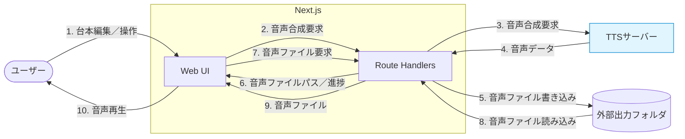

# vosc

音声台本エディタ＆音声合成インターフェースを備えた、ローカル実行用のWebアプリケーションです。
[Irodori-TTS-Server](https://github.com/Aratako/Irodori-TTS-Server)などの音声合成サーバーと連携し、YAML形式の音声台本の編集および台詞の音声合成を自動化することができます。

※個人用途の趣味プロジェクトであるため、動作の保証やサポートは行っていません。

## ✨ 特徴

**📝 台本エディタ**

- ビジュアルエディタ: 台詞や読み替え辞書をGUIで編集できる。
- コードエディタ: YAML形式の台本を直接編集できる。編集内容はビジュアルエディタと同期できる。
- Undo/Redo（編集履歴管理）
- キーボードショートカット
- コマンドパレット（一括編集などの便利な操作）

**🎙️ 音声合成**

- 外部の音声合成APIを使用し、台詞の音声ファイルを生成する。
- 台本全体の音声合成と、FFmpegによる音声ファイルの結合。

**📖 読み替え辞書**

- 特定の単語や固有名詞の発音を調整するための機能。
- 音声合成APIへリクエストする際、台詞のテキストを辞書に基づいて自動でよみがなへと置換する。

## 🚀 クイックスタート

### 1. 前提条件

- **Node.js**: 24.x
- **pnpm**: 11.x
- **FFmpeg**（台本全体の音声合成時に、各台詞の音声ファイルを結合するのに使用する。）
- **go-task**（または[Taskfile.yaml](./Taskfile.yaml)に記述されたコマンドを手動実行）
- **Irodori-TTS-Server**（または互換性のある音声合成APIサーバー）

> [!NOTE]
> Irodori-TTS-Server のインストール手順
> 詳細は[Irodori-TTS-Server](https://github.com/Aratako/Irodori-TTS-Server)を参照してください。
>
> ```bash
> # インストール
> git clone https://github.com/Aratako/Irodori-TTS-Server.git
> cd Irodori-TTS-Server
> uv sync --extra cu128
>
> # サーバーの起動
> uv run --no-sync python -m irodori_openai_tts
> ```

### 2. インストール

リポジトリをクローンし、依存関係をインストールする。

```bash
git clone https://github.com/shiguruikai/vosc.git
cd vosc
task setup
```

### 3. 環境設定

`.env.example`をコピーして`.env`ファイルを作成し、必要な設定を行う。

```bash
cp .env.example .env
```

`.env`の構成:

```env
# 音声合成サーバーのベースURL
TTS_API_BASE_URL=http://localhost:8088

# 生成された音声ファイルの保存先ディレクトリ
OUTPUT_DIR=./output
```

### 4. サーバーの起動

```bash
task run
```

起動後、ブラウザで[http://localhost:3000](http://localhost:3000)を開く。

## ⌨️ キーボードショートカット

| ショートカットキー                         | アクション                                     |
| :----------------------------------------- | :--------------------------------------------- |
| `Ctrl + Shift + A`<br />`Ctrl + Shift + P` | コマンドパレットを開く                         |
| `Ctrl + Z`                                 | 元に戻す (Undo)                                |
| `Ctrl + Shift + Z`                         | やり直す (Redo)                                |
| `Ctrl + Shift + C`                         | 台本の内容をクリップボードにコピー             |
| `Ctrl + Shift + D`                         | 台本の内容をクリップボードにコピー（IDは除く） |
| `Ctrl + O`                                 | 台本ファイルを選択して読み込む                 |
| `Ctrl + S`                                 | 台本ファイルをダウンロード                     |
| `Ctrl + Shift + S`                         | 台本ファイルをダウンロード（IDは除く）         |
| `Alt + 1`                                  | 「コードエディタ」タブに移動                   |
| `Alt + 2`                                  | 「台詞一覧」タブに移動                         |
| `Alt + 3`                                  | 「読み替え辞書」タブに移動                     |

対象をフォーカスしている場合に有効なショートカット:

| ショートカットキー | 対象                     | アクション           |
| :----------------- | :----------------------- | :------------------- |
| `Ctrl + Shift + ↑` | 台詞の編集フィールド     | 台詞の位置を上に移動 |
| `Ctrl + Shift + ↓` | 台詞の編集フィールド     | 台詞の位置を下に移動 |
| `Ctrl + Enter`     | 台詞のテキストフィールド | 台詞の音声合成       |

※Monaco Editor（コードエディタ）をフォーカスしている場合、Monaco Editorのショートカットが優先される。

## 📄 台本ファイルの構造

台本ファイルは以下のYAML形式（`.yaml`、`.yml`）で記述する。

```yaml
# 読み替え辞書の定義
words:
  - word: YAML
    reading: やむる # よみがなは、カタカナでもひらがなでも何でもよい。

# 台詞の定義
lines:
  - voice: ボイスID
    text: こんにちは。サンプルです。

  # すべてのプロパティを記述した例
  - id: a0de79d-3f5f-4a00-ba26-4d04847e112a # 自動生成される台詞ID
    voice: ボイスID
    text: 台詞テキスト
    speed: 1.2 # 速度 (0.3～4.0)
    seed: 42 # 音声合成のシード値 (デフォルトは -1 でランダム)
    file: a0de79d-3f5f-4a00-ba26-4d04847e112a.wav # 生成された音声ファイルのパス
```

---

## 🛠️ 技術スタック

### フロントエンド

- フレームワーク: Next.js 16 (App Router)
- 状態管理: Zustand, Immer, Zundo
- UI: Tailwind CSS, shadcn/ui
- コードエディター: Monaco Editor

### バックエンド

- フレームワーク: Next.js 16 (App Router, Route Handlers)
- バリデーション: Zod
- MIMEタイプの取得: mime-types

### 開発ツール

- ESLint プラグライン
  - @stylistic/eslint-plugin
  - eslint-plugin-simple-import-sort
  - eslint-plugin-unused-imports

## 🏗️ システム構成＆音声合成フロー



## 📂 プロジェクト構成

```text
.
├── .env.example                       # 環境変数の設定例
├── .gitignore                         # gitの無視ルール
├── AGENTS.md                          # AIエージェントへの指示（※未使用のため、デフォルトのまま）
├── CLAUDE.md                          # Claude Code向けの指示（AGENTS.mdを参照するだけ）
├── components.json                    # shadcn/uiの設定ファイル
├── eslint.config.mjs                  # ESLintの設定ファイル
├── LICENSE                            # ライセンスファイル（MIT）
├── next-env.d.ts                      # Next.jsのTypeScript宣言ファイル
├── next.config.ts                     # Next.jsの設定ファイル
├── package.json                       # プロジェクトの依存関係とスクリプト
├── pnpm-lock.yaml                     # pnpmのロックファイル
├── pnpm-workspace.yaml                # pnpmの設定ファイル
├── postcss.config.mjs                 # PostCSSの設定ファイル
├── README.md                          # プロジェクトの概要や開発手順
├── Taskfile.yaml                      # タスクランナーの設定ファイル
├── tsconfig.json                      # TypeScriptの設定ファイル
├── .vscode/                           # VSCodeのワークスペース設定フォルダ
│   ├── launch.json                    # デバッグの構成ファイル（サーバーとブラウザの両方をデバッグ起動する構成を定義）
│   └── settings.json                  # 設定ファイル（ESLintなどの設定）
└── src/                               # ソースフォルダ
    ├── app/                           # App Router
    │   ├── globals.css                # グローバルスタイル
    │   ├── layout.tsx                 # ルートレイアウト
    │   ├── page.tsx                   # ルートページ
    │   ├── providers.tsx              # 各種プロバイダを1つにまとめたプロバイダ
    │   ├── _components/               # ページ内部コンポーネント
    │   │   ├── app-bar.tsx            # ヘッダーバー（アプリタイトルと各種ボタン）
    │   │   ├── commands-palette.tsx   # コマンドパレット
    │   │   ├── commands-provider.tsx  # コマンド定義用のプロバイダ
    │   │   ├── full-audio.tsx         # 全体音声の生成および再生
    │   │   ├── lines-editor.tsx       # 台詞行の編集
    │   │   ├── log-viewer.tsx         # ログメッセージの表示
    │   │   ├── main-tabs.tsx          # メインのタブ
    │   │   ├── words-editor.tsx       # 読み替え辞書の編集
    │   │   └── yaml-editor.tsx        # Monaco Editorを使用した台本（YAML）の直接編集
    │   ├── api/                       # Web APIのエンドポイント
    │   │   └── audio/
    │   │       ├── _lib/              # 内部共通ロジック
    │   │       │   └── audio.ts       # 音声合成の処理
    │   │       ├── full/
    │   │       │   └─route.ts         # 全体音声合成・結合（Server-Sent Eventsで処理の進捗をストリーミング）
    │   │       ├── line/
    │   │       │   └─route.ts         # 単一台詞行用の音声合成
    │   │       └── voices/
    │   │           └─route.ts         # ボイス情報の取得
    │   └── output/                    # 外部の出力フォルダに生成された音声ファイルを静的ファイルとして配信するためのエンドポイント
    │       └── [...filePath]/         # 動的セグメント（ファイル名）
    │           └── route.ts           # HTTP Range Requestsに対応したファイルの配信
    ├── components/                    # 共通コンポーネント
    │   └── ui/                        # shadcn/uiで追加した各種コードを少しだけカスタマイズ ※ファイル数が多いため詳細は省略
    ├── hooks/                         # 共通フック
    │   └── key-bind.ts                # キーバインドの登録
    ├── lib/                           # 共通ロジック
    │   ├── api.client.ts              # Route HandlersのWeb APIを呼び出す関数（client-only）
    │   ├── api.server.ts              # TTSなどのWeb APIを呼び出す関数（server-only）
    │   ├── env.server.ts              # 環境変数の取得（server-only）
    │   ├── schemas.ts                 # スキーマ定義
    │   ├── utils.client.ts            # 共通処理（client-only）
    │   ├── utils.server.ts            # 共通処理（server-only）
    │   └── utils.ts                   # 共通処理
    └── stores/                        # 共通状態管理
        ├── active-tab-store.ts        # アクティブなタブ
        ├── command-configs-store.ts   # コマンド定義
        ├── commands-palette-store.ts  # コマンドパレットの開閉状態
        ├── lines-expand-store.ts      # 台詞行の詳細設定の開閉状態
        ├── logs-store.ts              # ログメッセージ
        └── script-store.ts            # 台本（編集、YAML変換、編集履歴管理など）
```

## 📄 ライセンス

[MIT License](./LICENSE)
